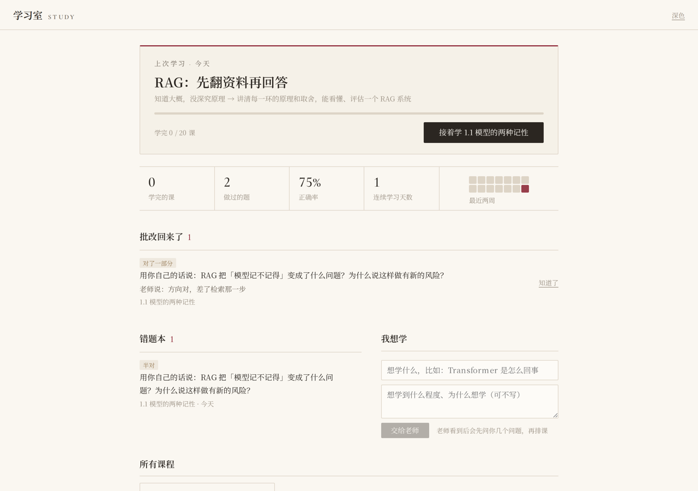
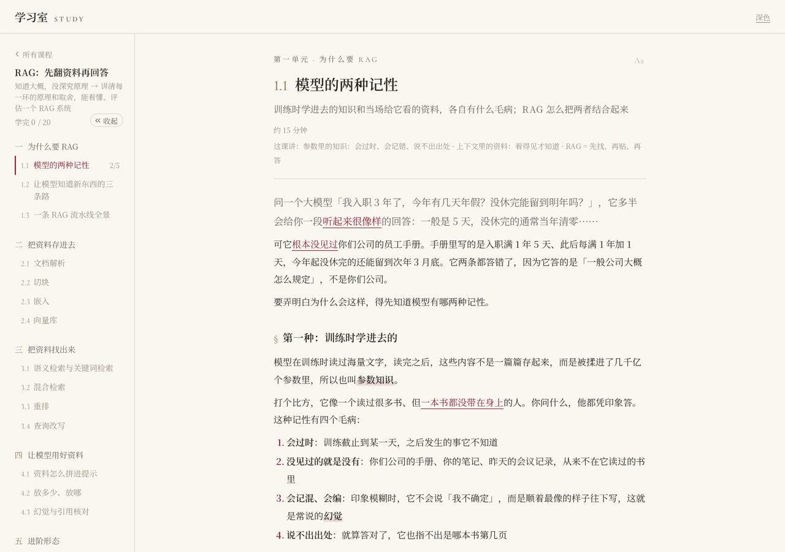
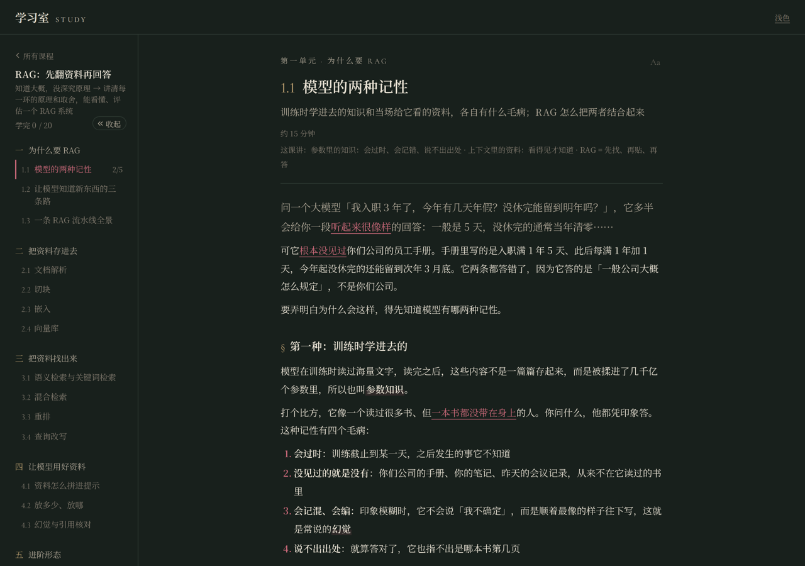

# 学习室 Study Room

让 Claude Code 当你的私人老师：先问你懂到哪、想学到什么程度，再排一门课的大纲，一课一课写讲义、出课后小测、批改你的简答题。
课都放在一个本地网页里读、做题、记错题，像一间安静的书房。



| 讲义 | 深色 | 手机 |
|---|---|---|
|  |  |  |

## 它能做什么

- **摸底再开课**：同一个主题，零基础和进阶讲法完全不同。老师先问起点、终点、喜欢的讲法，再排大纲给你看
- **讲义**：引子、分小节讲原理、对照表、配图、要点框、当心框，每课 15–30 分钟读完
- **课后小测**：单选、判断、多选、填空自动判分；简答交给老师批改，评语会回到首页
- **书房首页**：继续上次的课、学习统计、错题本（重做对了就移出去）、「我想学」许愿栏
- 深浅色、字号可调，手机上也能看

整套都在你自己电脑上跑，课和作答记录存在本地一个 SQLite 文件里，不上传任何地方。
页面字体从网上加载（中文思源宋体走 [ZeoSeven](https://zeoseven.com/)，西文走 Google Fonts），连不上时自动用系统字体，不影响使用。

## 需要准备

- [Node.js](https://nodejs.org/) 18 或更新（跑网页和后端）
- Python 3.9 或更新（老师写课用的小脚本，只用标准库）
- [Claude Code](https://docs.claude.com/en/docs/claude-code/overview)（老师本人）
- 可选：Playwright（老师给讲义画配图、写完截图自检时用）
  ```
  pip install playwright
  playwright install chromium
  ```

## 装起来

```bash
git clone https://github.com/Chiwawas/study-room.git
cd study-room
npm install
npm run build        # 打包网页
npm start            # 启动，打开 http://127.0.0.1:4173
```

第一次打开是空的。想先看看一课长什么样，另开一个终端导入示例课「RAG：先翻资料再回答」（大纲 + 写好的第一课）：

```bash
npm run seed
```

刷新页面就能看到。不想要了直接删掉 `data/study.db`，重启服务会建一个空的。

端口和地址可以改：`PORT=8080 npm start`；想让同一局域网的手机也能打开，用 `HOST=0.0.0.0 npm start`（注意这样局域网里谁都能打开）。

## 上课

在仓库目录里启动 Claude Code：

```bash
cd study-room
claude
```

仓库自带的 skill（`.claude/skills/study-room/`）会自动加载，直接跟它说话就行：

| 你说 | 老师做什么 |
|---|---|
| 开一门课学 Transformer | 先问你三个问题摸底，再排大纲给你看，你点头才建课 |
| 写下一课 / 把 2.3 写了 | 写讲义和小测，截图检查排版，告诉你这课讲了什么 |
| 看看我做的题 | 批改你交的简答题，评语会出现在首页「老师批改了」 |
| 1.2 里那个比方没看懂 | 读那课的讲义，按讲义给你讲 |
| 太深了 / 太浅了 | 改这课，并记下你喜欢的讲法，以后的课都照这个来 |

在网页首页「我想学」里写下的主题，下次跟老师说「看看我想学什么」它就会看到。

## 老师用的工具

都在 `tools/`，Claude Code 会自己用，你一般不用碰：

- `study_admin.py`：建课、写课、读课、看待批改的简答、批改（不带参数运行打印完整用法和 JSON 格式）
- `fig.py`：把一张 HTML 画的插图渲染成 PNG，放进 `data/fig/`
- `shot.py`：给学习室截图，写完课检查深浅色、电脑和手机宽度的排版
- `seed_example.py`：导入示例课

示例课的原始 JSON 在 `examples/rag/`，想知道一课的格式就看它。

## 目录

```
server/        后端：express + better-sqlite3，提供 /api/study/*，托管网页和配图
web/           网页：Vite + React
tools/         老师用的脚本
examples/rag/  示例课
.claude/skills/study-room/   老师的工作说明（Claude Code skill）
data/          你的数据库和配图（不进 git）
courses/       老师写课时留的 JSON 草稿（不进 git）
```

## 开发

```bash
npm run dev    # 网页热更新，/api 转到 npm start 起的服务
```

## 许可

[MIT](LICENSE)
